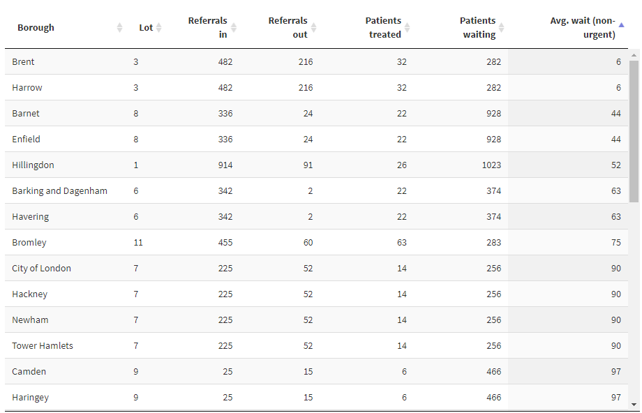

```{r setup, include=FALSE}
knitr::opts_chunk$set(echo = FALSE)
library(knitr)
library(dplyr)
library(rgdal)
library(leaflet)
library(glue)
```

## About the data and app

The app which this presentation is based on is used by the commissioners of dental surgery contracts in the boroughs of London. They asked for a dashboard that would allow them to see how each of the boroughs was performing. The data comes from a monthly survey completed by contractors, giving numbers of referrals, treatments and length of waiting lists etc.

All values in the example data have been randomised, so do not represent the real situation.

The example data is included in the Github repo so that anyone interested in using the code can quickly see the code in action.

https://github.com/nhsbsa-data-analytics/london-oral-surgey-mapping

## Why use a map for data visualisation?

Using a table, we can order the average wait column and see the boroughs with lowest waiting times easily enough.

But *where* are these boroughs in relation to each other?

```{r, fig.align="center", out.height="75%", out.width = "75%"}

```

## Why use a map for data visualisation?

With an appropriately coloured map we can see at a glance that the North to West perimeter has the lowest waiting times. This is of course exactly what a map is for!

> *a drawing that gives you a particular type of information about a particular area*
> `r tufte::quote_footer('--- Cambridge Dictionary')`

```{r, fig.align="center", out.height="45%", out.width = "45%"}

```

## What is Leaflet?

> *Leaflet is the leading open-source JavaScript library for mobile-friendly interactive maps; it has all the mapping features most developers ever need.*
> `r tufte::quote_footer('--- leafletjs.com')`

Luckily for us R users, there is a package available for R - also called leaflet. There are plenty of examples of using it at https://rstudio.github.io/leaflet/.


```{r, fig.align="center"}

```

## GIS data files

Leaflet maps are built by combining layers together to result in the desired map. These layers include base maps, such as provided by the Ordnance Survey, and data defined in some geographic information system (GIS) format. 

For this demo we will use GIS files provided by the Greater London Authority and available at https://data.london.gov.uk/download/statistical-gis-boundary-files-london/9ba8c833-6370-4b11-abdc-314aa020d5e0/statistical-gis-boundaries-london.zip.

There are several formats of GIS data. This demo uses what are known as shapefiles. Shapefile format can spatially describe vector features, i.e. points, lines, and polygons.

## Reading GIS data files

First we need to read in the GIS data.

The layer we will use is `London_Borough_Excluding_MHW`.

```{r, echo = TRUE}
boroughs <- readOGR(
  dsn = "../data/statistical-gis-boundaries-london/ESRI",
  layer = "London_Borough_Excluding_MHW",
  verbose = FALSE
) %>% suppressWarnings() # prevent warnings about discarded datums etc.
```

```{r, fig.align="center", out.width="100%", out.height="100%"}

```

## Structure of GIS data

`boroughs` is a special type of dataframe, defined in the `sp` package (which is loaded in with `rgdal`). It has multiple slots, accessed using the `@` symbol, like `boroughs@data`.

```{r, echo = TRUE}
class(boroughs)
```
```{r, echo = TRUE}
str(boroughs, max.level = 2)
```

## Modifying the GIS data

```{r, echo = TRUE}
str(boroughs@data)
```

Of the columns in the `@data` slot, we only need `NAME`. We can also change this to match the column name used in the surgery data, which we will soon see.

```{r, echo = TRUE}
boroughs@data <- boroughs@data %>%
  transmute(borough = NAME)
```

## Final GIS data steps

The coordinates in the GIS data are not in the standard used for the Global Positioning System (GPS). So they must be transformed.
epsg:4326 is one name for the GPS standard.

```{r, echo = TRUE}
boroughs <- boroughs %>% spTransform(CRS("+init=epsg:4326"))
```

When plotting the map, it is useful to get the bounds of the polygons included in the GIS data, so the map can be centered on the correct area.

```{r, echo = TRUE}
bounds <- boroughs@bbox
```

## Joining the data

The data structure is

```{r}
data <- readRDS("data.rds")

str(data, give.attr = FALSE)
```
The data can be merged into the data slot of `boroughs`. Take special care when modifying the `@data` slot! Don't change the order of the rows, or the polygon definitions will not match. The `sp` package has it's own safe version of `merge`.

```{r, echo = TRUE}
boroughs <- sp::merge(boroughs, data)
```

## Displaying the base map

```{r, echo = TRUE}
london_map <- leaflet(boroughs, height = 300) %>% # boroughs not yet used, but will soon be
  addTiles() %>% 
  setView( # Centre the map in the middle of our co-ordinates
    mean(bounds[1,]),
    mean(bounds[2,]),
    zoom = 9 # highest zoom that will show the whole area on load
  )
```

```{r}
london_map
```
## Creating a colour palette

We want to show the wait times by shading each borough according to some colour scale.

```{r, echo = TRUE}
# Colour palette mapped to chosen map highlight column
pal_map <- colorNumeric("YlGn", boroughs@data$avg_wait)
```

When there are NA values, the legend does not look right. So these are removed from the display.

```{r, echo = TRUE}
# Fix colour palette mapped to chosen map highlight column for legend; NAs 
# are removed. See https://github.com/rstudio/leaflet/issues/615 for issue
pal_legend <- colorNumeric("YlGn", boroughs@data$avg_wait, na.color = rgb(0, 0, 0, 0))
```

## Adding a layer to the map

```{r, echo = TRUE}
london_map <- london_map %>% 
  addPolygons(
    fillColor = ~pal_map(avg_wait),
    fillOpacity = 0.8
  ) %>%
  addLegend(
    "bottomright", 
    pal = pal_legend,
    values = ~avg_wait,
    title = "Average wait"
  )
```

```{r}
london_map
```

## Finishing touches

There are many ways to customise maps with Leaflet.

Add attribution for data used

```{r}
london_map %>% 
  addTiles(
    attribution = glue(
      'Contains ',
      '<a href="https://data.london.gov.uk/dataset/statistical-gis-boundary-files-london"',
      'target=_blank>',
      'National Statistics data</a> &copy; Crown copyright and database right [2015] ',
      'Contains ',
      '<a href="https://www.ordnancesurvey.co.uk/business-government/licensing-agreements/',
      'copyright-acknowledgements"',
      'target=_blank>',
      'Ordnance Survey data</a> &copy; Crown copyright and database right [2015]'
    )
  )
```

## Finishing touches

Adjust polygon properties and add labels

```{r, echo = TRUE, results='hide'}
london_map %>% 
  clearShapes() %>% # remove already existing polygons etc.
  addPolygons(
    fillColor = ~pal_map(avg_wait), fillOpacity = 0.8, color ='black', dashArray ='3',
    label = ~glue("
      <strong>Borough: </strong>{borough}<br>
      <strong>Lot: </strong>{lotnum}<br>
      <strong>Avg. wait: </strong>{avg_wait} weeks
    ") %>% lapply(htmltools::HTML)
  )
```

```{r, fig.align="center", out.width="65%", out.height="65%"}

```